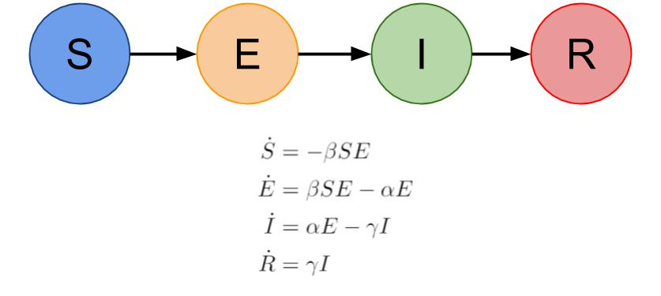
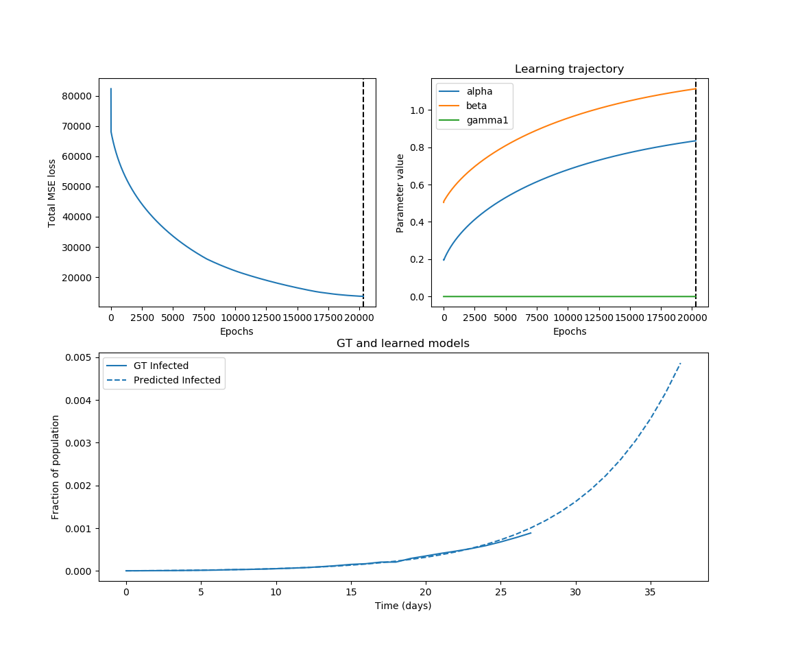

# Modeling the effect of weather on COVID-19 spread
This repo contains the codebase for studying the effect of temperature and humidity on COVID-19 spread.

## TL;DR
**Does weather affect COVID-19 spread?** 

**Yes, it does!!** (*Our analysis shows a slight trend towards decreased spread in hotter and humid climates*)

Each dot represents a region, with the color representing the region's geographical location. *Violet* represents Chinese provinces, *Blue* represent European nations, *Green* represents other Asian countries, *Yellow/Gold* represents US states and *Orange* represents Brazil.

## Tasks
+ [X] Collect COVID-19 cases' time series for different regions/countries
+ [X] Train a SEIR model to fit the data in the initial stages and correctly predict future data (a couple of days)
+ [X] Collect temperature and humidity data for the period the model is trained and tested on
+ [X] Plot the trends --> observe the model parameters as function of temperature and humidity
+ [ ] Use the weather forecast to predict COVID-19 cases by simulating a SEIR model with appropriate parameters

## Data collection and processing
-- Todo --

## Model fitting

We used a relatively simple, yet effective, compartment-based model called the SEIR model. Briefly, the entire population is divided into 4 compartments with the dynamics defined by the above equations: 
* **S** - representing the susceptible population, i.e. those who could get affected. We assume everyone can get affected.
* **E** - representing the exposed population, i.e. those who are carrying the virus but are not yet showing symptoms or haven't been tested and isolated
* **I** - representing the infected population, i.e. those who have been identified as COVID-positive patients and have been isolated and/or being treated. The number of cases for this compartment is reported.
* **R** - representing the recovered population, i.e. those who have recovered from the disease (or have succumbed to it). We did not keep a separate compartment for those who have died and hence this population is more of a placeholder for those who cannot be reinfected by the disease.

*__Note__: We have ignored the birth and death rate and hence assume the population to be constant for the time period of training and simulation. However, this could be easily included into the model if these values are known.*

Since, we are only provided with the (reliable) ground truth information about the infected population, we train out model parameters to best predict the growth of the infected cases. This is done using a gradient-based method (see [epoch_fit_params_corona_seir_population function](src/training/learn_model_params_population.py#L7)), which is similar to gradient-based TD learning. To estimate the efficacy of the learning algorithm, we evaluate it by training the model on simulated data ([test_fitting_population function](src/training/learn_model_params_population.py#L59)). Simulation results are shown below. 

*__Note__: We assumed 2 separate parameters 𝛾1 and 𝛾2 to take into account that some people could go into the recovered compartment from the exposed compartment without showing symptoms, i.e. without being counted as infected. However, we drop this for later experiments*

Finally, we fit the model parameters on the reported COVID-19 cases from a particular region. For each region, we trained on the initial exponential rise in order to understand the unintervened epidemic spread parameters, i.e. before lockdown or social distancing was enforced by the government. We validated the model's prediction on the last 3 timepoints of the selected time series segment and trained on the rest. Below is the model fit to **Italy**.

## Trends with weather
The above pipeline for model fitting is repeated for multiple regions to obtain the alpha and beta values for each region. Subsequently, we retireved the average temperature and humidity of these regions in the corresponding period of time. We had an additional hyperparameter in our model, i.e. the initial number of exposed people or number of exposed people on day 0 (w.r.t. model fitting). It was generally chosen as a multiplicative factor of the number of reported cases on day 0. Since this affected the learned value of alpha and beta, we used a correction strategy to compare all the regions with similar initial conditions. Finally, we plotted these corrected values against the temperature and humidity data (See [plot_dependence_corrected2 function](src/training/plot_weather_dependence.py#L90)). The scatter plots and corresponding trend lines are shown below.

Each dot represents a region, with the color representing the region's geographical location. *Violet* represents Chinese provinces, *Blue* represent European nations, *Green* represents other Asian countries, *Yellow/Gold* represents US states and *Orange* represents Brazil.

*__Note__: 3 regions were removed from the plots here because they were outliers (extremely high parameter values after correction). We believe this is because the initial number of exposed people was too high in these cases, indicating that we were unable to capture the beginning of the infection spread period.*

### Conclusions and disclaimers
1. There is a strong negative correlation between humidity and the model parameters (p-values 0.016 and 0.017 for alpha and beta respectively, calculated using permutation tests (See [do_permutation_tests function](src/training/plot_weather_dependence.py#L157))), thus indicating that drier areas have a higher rate of infection spread.
2. The trend with temperature seems to be comparatively weak, with 50-70 F being a rather dangerous temperature range wherein the infection spread is high. The parameter values turn out to be low for colder areas as well as higher areas.
3. We currently do not have enough datapoints to reliably comment on the infection spread at higher temperatures. These plots appear to indicate a trend of decreased disease spread, something that will get more and more clear as time progresses. 
4. We have currently ignored the effect of age distribution in the population, i.e. we have assumed all age groups to be equally susceptible or all regions to have similar age distribution. These assumptions are not accurate, and have been undertaken ir order to simplify the model.
5. We ignore the impact of different cultures on the spread of disease. For instance, some cultures could be more prone to infection spread because of increased social interaction and/or greeting techniques. We have ignored this currently in our analysis as well as other genetic factors that could make certain populations more susceptible.
